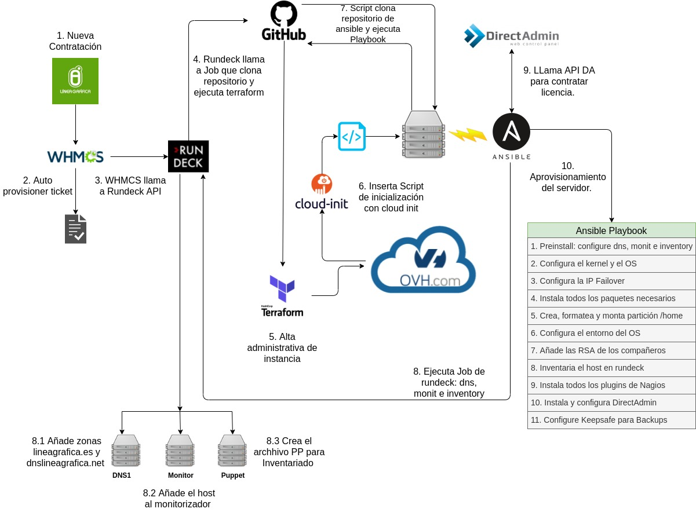

# Auto Instance Installer



When a new instance is deployed (AWS/OVH), this ansible role is the responsible of the provisioning of that instance.

The first step is call to **ovh-install-script.sh** from inside of the new instace (at the runtime). In OVH you must put the script during the instance deployment (ovh dashboard). In AWS, this script is passed from inside of CloudFormation template.

You must fill some parameters inside of **ovh-install-script.sh**. At the end of the script, you can see the following parameters (--extra-vars):
* ipFailover: the ip that was attached to the new server.
* cloud_provider: the cloud provider (ovh or aws).
* client_alias: the main domain of the client (ej, glowrias.com, sinhumo-sevilla.net, etc..).
* serverFQDN: the fqdn of the host (ej, hosting-2557-10286-cloud.lineagrafica.es).
* productID: the ID of the product, see the whmcs product URL.

Once the script is executed, as last step, a ansible common role is clonned and played.

The role is initialized when the auto-instace-installer.yml playbook is executed.

The goal of the role is:

    1. Deploy a rundeck job remotly that configure the requirements for puppet, nagios and dns1.
    2. Set the kernel parameters.
    3. Configure the network intarface with a second IP FAILOVER ip addresse.
    4. Install and configure packages.
    5. Mount the second device in /home partition.
    6. Configure the environment: language, time, etc..
    7. Add the RSA of the system mates.
    8. Configure puppet for inventory purpose.
    9. Configure Nagios MOnitoring
    10. Configure Keepsafe: backups

The following are the all steps which the program does.
```
1. Include Preinstall requirements: dns, puppet file and nagios file monitoring on service servers.
    1.1 Calling rundeck > provisioner > host_provisioner/dns_puppet_nagios/configure_dns_puppet_nagios.
        1.1.1 dns > add dns (hosting-xx-yy-cloud) inside dns1.lineagrafica.es
        1.1.2 dns > add dns (ns{1,2}sdxx) inside dns1.dnslineagrafica.net
        1.2.1 puppet > create the xxxx.pp file for instances inventory.
        1.3.1 Nagios > create the xxxx file for instance auto-monitoring
2. Include Kernel/OS configuration parameters.
    2.1 Disable Transparent Huge Pages in current session.
    2.2 Disable Transparent Huge Pages during bootstrap.
    2.3 Configure vim colour.
    2.4 Setting up Swappiness OFF.
    2.5 Setting up max Files handles.
    2.6 Setting up Virtual Memory (Overcommit).
    2.7 Setting up Virtual Memory (MMAP).
3. Include Network Interface configuration: netplan.
    3.1 Ensure IP Failover is configured.
    3.2 Add IP failover into 50-cloud-init.yaml file.
    3.3 Apply netplan changes.
4. Include the installation of the common packages.
    4.1 Upgrade the version of all packages: dist-upgrade.
    4.2 Install htop.
    4.3 Install the latest Python version.
    4.4 Install Python3-pip.
    4.5 Install awscli-plugin-endpoint.
    4.6 Install AWS CLI: OVH Horizon purpose.
    4.7 Ensure {{ awscli_basedir }} folder exists.
    4.8 Configure AWS CLI Credentials for AWS/S3.
    4.9 Install GIT.
    4.10 Install ntp & ntpdate.
    4.11 Install psmem for HEAP memmory monitoring.
5. Include mount /home partition
    5.1 Check if new volume exists.
    5.2 Check if {{ new_partition }} exists.
    5.3 Create {{ new_partition }} partition if {{ block_device }} exists and {{ new_partition }} is not found.
    5.4 Format the {{ new_partition }} partition using ext4.
    5.5 Check if /etc/fstab mount partition exists.
    5.6 Add line into /etc/fstab for automounting.
    5.7 Create temp path to mount volume before sync home directory.
    5.8 Mount new volume in temp path.
    5.9 Sync /home directory against {{ temp_mount_folder }}.
    5.10 Umount temp path.
    5.11 Check if {{ new_partition }} is mounted over /home.
    5.12 Finally, mount the device in his real path.
6. Include Environment configuration.
    6.1 Rename the instance.
    6.2 Check if date in {{ root_bashrc }} is enabled.
    6.3 Enable date in {{ root_bashrc }}.
    6.4 Create {{ custom_env }} file.
    6.5 Delete /etc/localtime link...
    6.6 Set the Europe/Madrid timezone.
    6.7 Check if SSH Password authentication is enabled.
    6.8 Delete older configuration on PasswordAuthentication SSH configuration.
    6.9 Ensure SSH Password Authentication is disabled.
    6.10 Check if SSH ClientAliveInterval is Set.
    6.11 Delete older configuration of ClientAliveInterval in SSH.
    6.12 Ensure SSH Client Alive Internal is Set.
    6.13 Check if SSH ClientAliveCountMax is Set.
    6.14 Delete older configuration of ClientAliveCountMax in SSH.
    6.15 Ensure SSH ClientAliveCountMax is Set.
    6.16 Update the local time: cica.es.
    6.17 Source the environment files.
    6.18 Set Message of today with a client identification name.
7. Include RSA insertion
    7.1 Add RSA of all members of Hosting team.
8. Include Puppet node Inventory: {{ productID }}.pp
    8.1 Download Puppet Agent repository file.
    8.2 Install Puppet Agent repository.
    8.3 Ensure puppet agent is installed.
    8.4 Ensure puppet-agent is configured.
    8.5 Ensure puppet agent is executed.
    8.6 Iniciar servicio puppet.
9. Enable Nagios Monitoring
    9.1 Install nagios plugin monitor.
    9.2 Ensure the folder {{ nagiosLibexecFolder }} exists.
    9.3 Download all nagios plugins.
    9.4 Set the correct permissiones over all nagios plugins.
    9.5 Ensure the folder {{ nagiosBaseDir }} exists.
    9.6 Copy the my.cnf file inside {{ nagiosBaseDir }}.
    9.7 Restarting nrpe service...
10. Configure Keepsafe: backups.
    10.1 Install s3 fuse to mount s3 object storage.
        11.1.1 Updating /usr/bin/python symlink: from python2.7 to /usr/bin/python3
        11.1.2 Install s3fuse on either Ubuntu or Debian.
        11.1.3 Enable EPEL Repository when OS family is CentOS or CloudLinux 
    and major version is 7.
        11.1.4 Enable EPEL Repository when OS family is CentOS and major version is 8.
        11.1.5 Install s3fuse on either CentOS or CloudLinux 7.
        11.1.6 Install s3fuse on either CentOS or CloudLinux 8.
        11.1.7 Set credentials for s3fuse object storage.
    10.2 Configure Cloud Provider API credentials (AWS/OVH).
        11.2.1 Ensure AWS CLI folder exists.
        11.2.2 Configure AWS/OVH API config and profile (/root/.aws/{config,credentials}).
    10.3 Ensure Mountpoints exist.
        11.3.1 Check if S3 MountPoints exist.
        11.3.2 DEBUG: The Mountpoint already exist.
        11.3.3 Create MountPoints directories if not exist.
    10.4 Ensure client server folder exists.
        11.4.1 Ensure destination folder is created in S3 buckets when it does not exists.
    10.5 Configure /etc/fstab in order to auto-mount s3 object storage.
        11.5.1 Check if s3fuse fstab line exists.
        11.5.2 Update fstab configuration.
        11.5.3 Add mount s3 objetc storage into /etc/fstab if it not exists.
    10.6 Mount s3 object storage in all mountpoints.
        11.6.1 Check if S3 bucket is mounted.
        11.6.2  Mount S3 MountPoint.
    10.7 Create backup folders for each panel.
        11.7.1 Get the panel which the server is running on.
        11.7.2 Check if custom folders exist.
        11.7.3 Create custom folders for backups: system, accounts, tmp_database, databases and data.
    10.8 Configure files to backed for DirectAdmin panel.
        11.8.1 Get the panel which the server is running on.
        11.8.2 Configure files to backed for DirectAdmin panel.
        11.8.3 Configure files to backed for cPanel panel.
```
