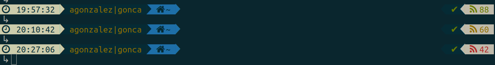
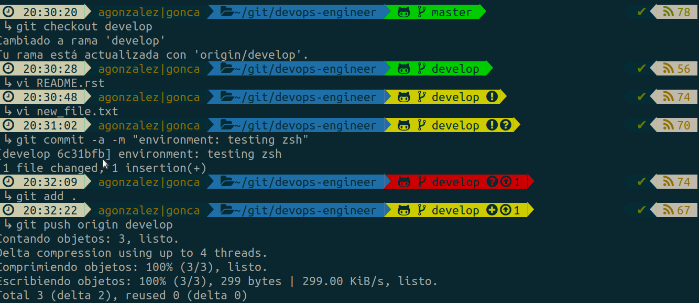
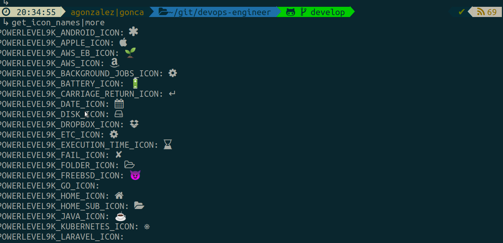

Configure ZSH
#############

1. Descargar, instalar y configurar oh-my-zsh
    $ https://github.com/ohmyzsh/ohmyzsh

2. Instalar Powerlevel9k theme
    https://github.com/Powerlevel9k/powerlevel9k/wiki/Install-Instructions#step-1-install-powerlevel9k3

3. Instalar fuentes recomendadas para customizar el shell

    3.1 Instalar powerline font/symbols

        ref: https://powerline.readthedocs.io/en/latest/installation/linux.html#fonts-installation

        How to
        ------

        $ cd ~/tmp
        $ wget https://github.com/powerline/powerline/raw/develop/font/PowerlineSymbols.otf
        $ wget https://github.com/powerline/powerline/raw/develop/font/10-powerline-symbols.conf
        $ xset q (para mirar el path y elegir uno)
        $ sudo mv PowerlineSymbols.otf /usr/share/fonts/X11/Type1/
        $ fc-cache -vf /usr/share/fonts/X11/Type1
        $ mkdir -p ~/.config/fontconfig/conf.d/
        $ mv 10-powerline-symbols.conf ~/.config/fontconfig/conf.d/

        Reiniciar la consola.

    3.2 Instalar fonts-powerline
        $ sudo apt-get install fonts-powerline

    3.3 Instalar awesome-terminal-fonts

        $ cd ~/git
        $ git clone git@github.com:gabrielelana/awesome-terminal-fonts.git
        $ cd awesome-terminal-fonts
        $ git checkout patching-strategy
        $ sudo apt install python-fontforge
        $ ./droid.sh

    Si todavía sigues sin visualizar correctamente los simbolos, prueba con:

        (Continuando en el repositorio anterior)

        $ git checkout master
        $ cd build
        $ mkdir ~/.fonts
        $ cp * ~/.fonts
        $ cd .. && cd config
        $ vi 10-symbols.conf
        sobreescribe "PragmataPro" por FontAwesome
        $ cp 10-symbols ~/.config/fontconfig/conf.d
        $ source ~/.fonts/*.sh
        $ vi ~/.zshrc
        añadimos la línea -> source ~/.zshrc
        y la línea (si no existiese) -> POWERLEVEL9K_MODE="awesome-fontconfig"

        Reiniciamos terminal y probamos

4. Customizar el prompt
   
**Archivo de ejemplo: zshrc (~/.zshrc)**

* https://github.com/Powerlevel9k/powerlevel9k
* https://github.com/Powerlevel9k/powerlevel9k/wiki/Stylizing-Your-Prompt

Los iconos que han sido utilizados en el prompt para Github han sido:

* github  
* incoming changes 
* outgoing changes  
* branch 
* staged 
* unstaged 
* untracked 

Podemos ver todos los iconos disponibles con:

.. code:: console

    $ get_icon_names

