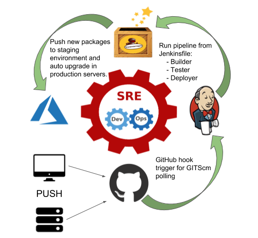

nebul4ck CI/CD
##############

** NOTE**: this pipeline doesn't work because it needs third party components like "buanarepo". This pipeline is only a ilustration of how groovy shared library works.

Shared Libraries
****************

* This repo keeps a custom Jenkins Shared Library: **saturn_ci_cd**

Stages
******

During the stages, **Jenkins clone the code from github repository** (develop or master branch, it is depend of the commit that the developer did), after that, a **test cycle is launched into development environment** and if all work fine, **jenkins up the software version**, **auto-merge master and development branches**, **tags the new version** on github and finally, clone the master branch and **deploy the code on production environment**.
