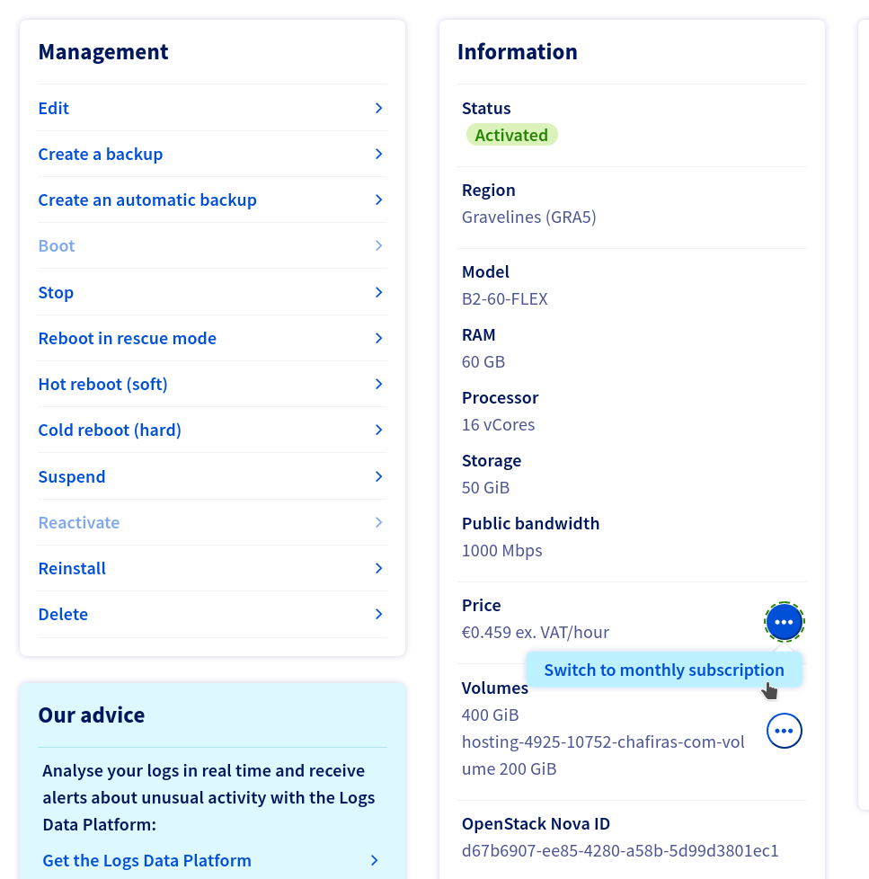

# Despliegue una instancia OVH con Terraform

1. Clonar el repositorio
```
git clone git@github.com:LINEA-GRAFICA/tf-hosting-instance-deployment.git
```

2. Crear una carpeta para el proyecto (lo siguiente es únicamente un ejemplo pero se recomienda crear y copiar el contenido a una carpeta nueva para no modificar los archivos del repositorio):
```
mkdir -p ~/hosting-projects/hosting-67-10999-cloud
```
```
cd ~/hosting-projects/hosting-67-10999-cloud
```

3. Copiar el contenido del repositorio en la nueva carpeta
```
cp -R ~/git/tf-hosting-instance-deployment/* .
```

4. Crear el archivo "secure.yaml".

**NOTA** el usuario y las credenciales tendremos que cogerlas de syspass (https://syspass.lineagrafica.es). Tener en cuenta que existen credenciales para el proyecto de **hosting** y credenciales para el proyecto de **intranet**. Si la instancia que se va a desplegar es para el proyecto de intranet, deberemos de coger las apropiadas. **En intranet están todas las instancias desplegadas para Línea Gráfica, mientras que en hosting están las instancias de los clientes.**

```
cat << EOF > secure.yaml
clouds:
  openstack:
    auth:
      username: "user-LEAz4wHwfzTT"
      password: "qQkusFhDUuESTOnoVALEU1hXMWsSpWtxjkY5P9XV"
EOF
```

5. Modificar el archivo clouds.yaml asignando un "username", un "project_id" y un "project_name". Estos datos los podremos encontrar en **syspass** (https://syspass.lineagrafica.es). Según que proyecto sea en el que vayamos a desplegar, tendremos que seleccionar unos datos u otros. Los proyectos son "Hosting" (para instancias de clientes) y/o "Intranet" (para instancias internas de Línea Gráfica). La región "region_name" siempre será GRA5 para proyecto hosting y/o GRA11 para proyecto Intranet. El "user_domain_name" siempre en "Default".

6. Setear correctamente el valor de las variables en el archivo *variables.tf*

* **client_ID**: id de cliente en WHMCS
* **product_ID**: id de producto en WHMCS
* **domain**: dominio del cliente sustituyendo el '.' por '-'. Ej chafiras-com
* **lg_project**: para instancias de clientes el proyecto es "hosting". Si la instancia desplegada es para servicios internos de Línea Gráfica, el proyecto será "intranet".
* **root_volume_size**: tamaño de volumen acorde a la instancia seleccionada
* **home_size**: tamaño de volumen para el /home contratado por el cliente. En ausencia de volumen extra, este será de 200
* **key_pair**: SSH privada de la instancia. Si el servidor es para hosting, la key_pair is lg_master_root. Si el servidor es para intranet, la key_pair es lg-intranet-master-root
* **flavor**: tipo de instancia a desplegar en OVH, ej b2-30 (cloud estándar).
* **image_os**: imagen de ubuntu a utilizar. Por defecto "Ubuntu 21.04".

7. Ahora hay que ir a la carpeta cloud-init para setear algunas variables que le pasaremos al aprovisionador de ansible. Estas variables se modifican en el parámetro "extra-vars" del comando de ansible:

```
cd cloud-init
```
```
vi ovh-autoprovisioner.sh
```
```
    --extra-vars \
        "ipFailover=94.23.85.31 \
        cloud_provider=ovh \
        client_alias=chafiras.com \
        serverFQDN=hosting-4925-10752-cloud.lineagrafica.es \
        productID=10752" \
```

Este playbook de ansible es ejecutado durante el despliegue de la instancia, es lo mismo que hacemos por el panel de control de OVH durante la configuración de la instancia donde insertamos un script. Este script configura el entorno para poder tener las herramientas necesarias para el despliegue de ansible: git, ansible y la **RSA de Rundeck** la cual está configurada en el repositorio de GitHub.

8. Una vez todo preparado, comprobaremos que los archivos de Terraform están correctos:

```
terraform init; terraform fmt; terraform validate

Initializing the backend...

Initializing provider plugins...
- Finding terraform-provider-openstack/openstack versions matching "~> 1.44.0"...
- Finding latest version of hashicorp/template...
- Installing terraform-provider-openstack/openstack v1.44.0...
- Installed terraform-provider-openstack/openstack v1.44.0 (self-signed, key ID 4F80527A391BEFD2)
- Installing hashicorp/template v2.2.0...
- Installed hashicorp/template v2.2.0 (signed by HashiCorp)

Partner and community providers are signed by their developers.
If you'd like to know more about provider signing, you can read about it here:
https://www.terraform.io/docs/cli/plugins/signing.html

Terraform has created a lock file .terraform.lock.hcl to record the provider
selections it made above. Include this file in your version control repository
so that Terraform can guarantee to make the same selections by default when
you run "terraform init" in the future.

Terraform has been successfully initialized!

You may now begin working with Terraform. Try running "terraform plan" to see
any changes that are required for your infrastructure. All Terraform commands
should now work.

If you ever set or change modules or backend configuration for Terraform,
rerun this command to reinitialize your working directory. If you forget, other
commands will detect it and remind you to do so if necessary.
Success! The configuration is valid.
```

9. Si todo ha ido correcto, ejecutamos el despliegue
```
terraform apply -auto-approve
```

**NOTA** Si perservamos esta carpeta de proyecto por un largo tiempo y el cliente se da de baja, podríamos eliminar toda su infraestructura tal que así:
```
terraform destroy
```

10. Ahora mientras se está desplegando todo, iremos "rápidamente" al panel de OVH Public Cloud > Network > IP Failover y asignaremos la IP Failover seleccionada a la nueva instancia que se estará creando.

11. Terminado el despliegue, iremos a la ficha de la instancia en el proveedor y cambiaremos la forma en la que se paga la instancia, pasando a "monthly subscription"



12. Por último, terminamos de rellenar la ficha del producto con los siguientes campos:

    **ID PROVEEDOR**: <id asignado a la isntancia. Ej, 143afcc6-041f-40c2-b8c4-3026f542c88e>. Este campo tiene el siguiente nombre en la ficha del servidor del proveedor: OpenStack Nova ID
    **MONITORIZAR**: true
    **FICHA DE SERVIDOR EN PROVEEDOR**: <url de la instancia en OVH>